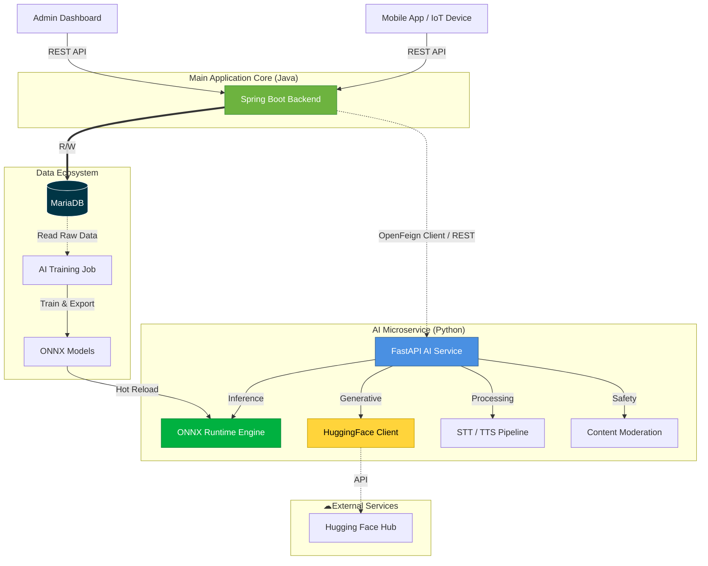

<a id="readme-top"></a>
<div align="center">


<div align="center">

  <a href="https://github.com/luantnk/SmartQuitIoT-AI/actions/workflows/ci-cd.yml">
    
  </a>

  <a href="https://github.com/luantnk/SmartQuitIoT-AI/actions/workflows/format-code.yml">
    
  </a>
  
  <a href="https://github.com/luantnk/SmartQuitIoT-AI/actions/workflows/github-code-scanning/codeql">
    
  </a>

  <a href="https://github.com/luantnk/SmartQuitIoT-AI/actions/workflows/dependabot/dependabot-updates">
    
  </a>

</div><!-- PROJECT SHIELDS -->

[![Python][Python-shield]][Python-url]
[![FastAPI][FastAPI-shield]][FastAPI-url]
[![PyTorch][PyTorch-shield]][PyTorch-url]
[![XGBoost][XGBoost-shield]][XGBoost-url]
[![ONNX][ONNX-shield]][ONNX-url]
[![Docker][Docker-shield]][Docker-url]
[![GitHub Actions][Actions-shield]][Actions-url]
[![License][License-shield]][License-url]

</div>

<!-- PROJECT LOGO -->
<br />
<div align="center">
  <a href="https://github.com/github_username/SmartQuitIoT-AI">
    
  </a>

  <h3 align="center">SmartQuit IoT AI Microservice</h3>

  <p align="center">
    <strong>High-Performance AI Engine for Smoking Cessation & Health Monitoring</strong>
    <br />
    Hybrid ML/DL Architecture • Real-time Inference • Generative AI Coach
    <br />
    <br />
    <a href="#-api-documentation"><strong>Explore API Docs »</strong></a>
    <br />
    <br />
  </p>
</div>

---

<!-- TABLE OF CONTENTS -->
<details>
  <summary>Table of Contents</summary>
  <ol>
    <li>
      <a href="#-about-the-project">About The Project</a>
      <ul>
        <li><a href="#-system-architecture">System Architecture</a></li>
        <li><a href="#️-built-with">Built With</a></li>
      </ul>
    </li>
    <li>
      <a href="#-key-features">Key Features</a>
      <ul>
         <li><a href="#-predictive-analytics">Predictive Analytics</a></li>
         <li><a href="#-generative-ai-coach">Generative AI Coach</a></li>
         <li><a href="#️-audio-processing">Audio Processing</a></li>
         <li><a href="#-automated-mlops">Automated MLOps</a></li>
      </ul>
    </li>
    <li><a href="#-devops--security">DevOps & Security</a></li>
    <li><a href="#-getting-started">Getting Started</a></li>
    <li><a href="#-usage">Usage</a></li>
    <li><a href="#-api-documentation">API Documentation</a></li>
    <li><a href="#-contributing">Contributing</a></li>
    <li><a href="#-license">License</a></li>
    <li><a href="#-contact">Contact</a></li>
  </ol>
</details>

---

## About The Project

**SmartQuit IoT AI** is the intelligence core powering the SmartQuitIoT ecosystem—a comprehensive platform designed to help individuals quit smoking through data-driven insights and personalized AI coaching. This microservice serves as the centralized AI engine, handling advanced data processing, machine learning inference, and generative AI interactions for both mobile applications and administrative dashboards.

### What Makes This Different?

This isn't just another REST API. SmartQuit AI implements a **Hybrid AI Architecture**, strategically combining:

- **Classical Machine Learning** (XGBoost) for structured data predictions with sub-millisecond latency
- **Deep Learning** (Transformers) for unstructured data processing (audio, natural language)
- **Generative AI** for personalized health coaching and behavioral insights
- **Production-Grade MLOps** with automated training, versioning, and hot-reload capabilities

### System Architecture


## Getting Started

### 1. Configure Environment

Create a file named `.env` in the root directory and paste the following configuration:

```env
DB_USER=YOUR_USER
DB_PASSWORD=YOUR_PASSWORD
DB_HOST=YOUR_HOST
DB_PORT=YOUR_PORT
DB_NAME=YOUR_DATABASE_NAME
HUGGINGFACEHUB_API_TOKEN=YOUR_TOKEN_API
```

### 2. Installation Methods

#### Option A: Run via Docker (Fastest)

You can pull the pre-built image directly from the GitHub Container Registry.

```bash
# Pull the image
docker pull ghcr.io/luantnk/smartquitiot-ai:sha-06afe59da586a4686147f8ebde80a72454e8af95

# Run the container (using your .env file)
docker run -d \
  -p 8000:8000 \
  --env-file .env \
  ghcr.io/luantnk/smartquitiot-ai:sha-06afe59da586a4686147f8ebde80a72454e8af95
```

#### Option B: Run from Source

If you want to develop or modify the code locally:

```bash
# 1. Clone the repository
git clone https://github.com/luantnk/smartquitiot-ai.git
cd smartquitiot-ai

# 2. Install dependencies
pip install -r requirements.txt

# 3. Start the server
uvicorn app.main:app --reload --host 0.0.0.0 --port 8000
```

### 3. Verify Installation

Once the server is running, verify it's working correctly:

```bash
# Check health endpoint
curl http://localhost:8000/health

# Expected response:
# {"status": "healthy", "models_loaded": true}
```

Access the interactive API documentation at:
- Swagger UI: http://localhost:8000/docs
- ReDoc: http://localhost:8000/redoc

### Built With

This project leverages a carefully selected stack optimized for performance, scalability, and developer experience:
**Core Framework:**
* [![Python][Python-shield]][Python-url]
* [![FastAPI][FastAPI-shield]][FastAPI-url]
* [![Uvicorn][Uvicorn-shield]][Uvicorn-url]
* [![Swagger][Swagger-shield]][Swagger-url]

**Machine Learning & AI:**
* [![XGBoost][XGBoost-shield]][XGBoost-url]
* [![Scikit-Learn][Scikit-shield]][Scikit-url]
* [![PyTorch][PyTorch-shield]][PyTorch-url]
* [![HuggingFace][HuggingFace-shield]][HuggingFace-url]
* [![LangChain][LangChain-shield]][LangChain-url]

**Model Optimization & Inference:**
* [![ONNX][ONNX-shield]][ONNX-url]
* [![HuggingFace Accelerate][Accelerate-shield]][HuggingFace-url]

**Audio & Vision Processing:**
* [![OpenCV][OpenCV-shield]][OpenCV-url]
* [![Pillow][Pillow-shield]][Pillow-url]
* [![FFmpeg][FFmpeg-shield]][FFmpeg-url]

**Data Science & Visualization:**
* [![Pandas][Pandas-shield]][Pandas-url]
* [![NumPy][NumPy-shield]][NumPy-url]
* [![SciPy][SciPy-shield]][SciPy-url]
* [![Matplotlib][Matplotlib-shield]][Matplotlib-url]
* [![Seaborn][Seaborn-shield]][Seaborn-url]

**Database & ORM:**
* [![SQLAlchemy][SQLAlchemy-shield]][SQLAlchemy-url]
* [![MariaDB][MariaDB-shield]][MariaDB-url]
* [![PyMySQL][PyMySQL-shield]][PyMySQL-url]

**DevOps & Quality Assurance:**
* [![Docker][Docker-shield]][Docker-url]
* [![GitHub Actions][Actions-shield]][Actions-url]
* [![Trivy][Trivy-shield]][Trivy-url]
* [![Discord][Discord-shield]][Discord-url]
* [![Black][Black-shield]][Black-url]
* [![Flake8][Flake8-shield]][Flake8-url]
* [![Pytest][Pytest-shield]][Pytest-url]

    <p align="right">(<a href="#readme-top">⬆ back to top</a>)</p>
---

## Key Features

### Predictive Health Analytics
The system utilizes optimized **XGBoost** models converted to **ONNX** format to deliver sub-millisecond inference on standard CPUs. Key capabilities include calculating the probability of smoking cessation success based on biopsychosocial metrics and predicting specific daily peak craving times to enable proactive interventions.

### Generative AI Coach
Integrated with **Large Language Models (LLMs)** via the **Hugging Face Inference API**, the service functions as a personalized health companion. It analyzes user logs to generate clinical-grade weekly progress summaries, detects sentiment patterns in diaries, and provides context-aware distraction strategies during high-stress moments.

### Advanced Audio Intelligence
The microservice features a full-stack audio processing pipeline powered by **Transformer models**. It employs **OpenAI's Whisper** for high-accuracy speech-to-text transcription of user journals and **Microsoft's SpeechT5** for natural, synthesized voice responses, enabling seamless hands-free interaction.

### Content Safety & Moderation
To ensure a safe user environment, the system automatically filters inputs using specialized deep learning models. It utilizes **BERT-based classifiers** to detect toxic or abusive text and **computer vision models** to scan for and block NSFW imagery before processing.

### Automated MLOps Pipeline
The architecture supports a self-sustaining learning loop. An automated pipeline periodically ingests raw data from the database, retrains **XGBoost** models, converts them to **ONNX** for optimization, and performs hot-reloads on the live API without requiring server downtime.

## Contributing

Contributions make the open-source community an amazing place to learn, inspire, and create. **Any contributions you make are greatly appreciated!**
### How to Contribute

1. **Fork the Project**
2. **Create your Feature Branch**
   ```bash
   git checkout -b feature/AmazingFeature
   ```
3. **Commit your Changes**
   ```bash
   git commit -m 'Add some AmazingFeature'
   ```
4. **Push to the Branch**
   ```bash
   git push origin feature/AmazingFeature
   ```
5. **Open a Pull Request**

### Development Guidelines

- Follow PEP 8 style guide (enforced by Black formatter)
- Write unit tests for all new features (maintain 80%+ coverage)
- Update documentation for API changes
- Use conventional commits: `feat:`, `fix:`, `docs:`, `refactor:`

### Code Review Process

All submissions require review. We aim to provide feedback within 48 hours.

<p align="right">(<a href="#readme-top">⬆ back to top</a>)</p>

---

## License

Distributed under the **MIT License**. See `LICENSE` file for more information.

This means you are free to use, modify, and distribute this software, even for commercial purposes, as long as you include the original license and copyright notice.

<p align="right">(<a href="#readme-top">⬆ back to top</a>)</p>

---

## Contact

**Tran Ngoc Kinh Luan** - Backend/Mobile Developer

[](https://www.linkedin.com/in/luantnk0729/)
[](mailto:luantnk2907@gmail.com)
[](https://github.com/luantnk)

**Project Link:** [https://github.com/luantnk/SmartQuitIoT-AI](https://github.com/luantnk/SmartQuitIoT-AI)

<p align="right">(<a href="#readme-top">⬆ back to top</a>)</p>

---

## Acknowledgments

Special thanks to:

- [FastAPI](https://fastapi.tiangolo.com/) for the excellent async web framework
- [Hugging Face](https://huggingface.co/) for democratizing AI and providing the model hub
- [ONNX Runtime](https://onnxruntime.ai/) team for making ML inference blazingly fast
- [XGBoost](https://xgboost.readthedocs.io/) community for the robust gradient boosting library
- All contributors and testers who helped shape this project

<p align="right">(<a href="#readme-top">⬆ back to top</a>)</p>

---

<!-- MARKDOWN LINKS & IMAGES -->
[Python-shield]: https://img.shields.io/badge/Python-3.10+-3776AB?style=for-the-badge&logo=python&logoColor=white
[Python-url]: https://www.python.org/
[FastAPI-shield]: https://img.shields.io/badge/FastAPI-009688?style=for-the-badge&logo=fastapi&logoColor=white
[FastAPI-url]: https://fastapi.tiangolo.com/
[Uvicorn-shield]: https://img.shields.io/badge/Uvicorn-2C3E50?style=for-the-badge&logo=gunicorn&logoColor=white
[Uvicorn-url]: https://www.uvicorn.org/
[Swagger-shield]: https://img.shields.io/badge/-Swagger-%23Clojure?style=for-the-badge&logo=swagger&logoColor=white
[Swagger-url]: https://swagger.io/

[XGBoost-shield]: https://img.shields.io/badge/XGBoost-4285F4?style=for-the-badge&logo=xgboost&logoColor=white
[XGBoost-url]: https://xgboost.readthedocs.io/
[Scikit-shield]: https://img.shields.io/badge/scikit--learn-%23F7931E.svg?style=for-the-badge&logo=scikit-learn&logoColor=white
[Scikit-url]: https://scikit-learn.org/
[PyTorch-shield]: https://img.shields.io/badge/PyTorch-EE4C2C?style=for-the-badge&logo=pytorch&logoColor=white
[PyTorch-url]: https://pytorch.org/
[HuggingFace-shield]: https://img.shields.io/badge/%F0%9F%A4%97%20Hugging%20Face-Transformers-FFD21E?style=for-the-badge&logo=huggingface&logoColor=black
[HuggingFace-url]: https://huggingface.co/
[LangChain-shield]: https://img.shields.io/badge/LangChain-1C3C3C?style=for-the-badge&logo=langchain&logoColor=white
[LangChain-url]: https://python.langchain.com/
[Accelerate-shield]: https://img.shields.io/badge/Accelerate-FFD21E?style=for-the-badge&logo=huggingface&logoColor=black

[ONNX-shield]: https://img.shields.io/badge/ONNX-005CED?style=for-the-badge&logo=onnx&logoColor=white
[ONNX-url]: https://onnx.ai/

[Pandas-shield]: https://img.shields.io/badge/pandas-%23150458.svg?style=for-the-badge&logo=pandas&logoColor=white
[Pandas-url]: https://pandas.pydata.org/
[NumPy-shield]: https://img.shields.io/badge/numpy-%23013243.svg?style=for-the-badge&logo=numpy&logoColor=white
[NumPy-url]: https://numpy.org/
[SciPy-shield]: https://img.shields.io/badge/SciPy-%230C55A5.svg?style=for-the-badge&logo=scipy&logoColor=%23white
[SciPy-url]: https://scipy.org/
[Matplotlib-shield]: https://img.shields.io/badge/Matplotlib-%23ffffff.svg?style=for-the-badge&logo=Matplotlib&logoColor=black
[Matplotlib-url]: https://matplotlib.org/
[Seaborn-shield]: https://img.shields.io/badge/Seaborn-77ACF1?style=for-the-badge&logo=pandas&logoColor=white
[Seaborn-url]: https://seaborn.pydata.org/

[OpenCV-shield]: https://img.shields.io/badge/opencv-%23white.svg?style=for-the-badge&logo=opencv&logoColor=black
[OpenCV-url]: https://opencv.org/
[Pillow-shield]: https://img.shields.io/badge/Pillow-3776AB?style=for-the-badge&logo=python&logoColor=white
[Pillow-url]: https://python-pillow.org/
[FFmpeg-shield]: https://img.shields.io/badge/FFmpeg-007808?style=for-the-badge&logo=ffmpeg&logoColor=white
[FFmpeg-url]: https://ffmpeg.org/

[SQLAlchemy-shield]: https://img.shields.io/badge/SQLAlchemy-D71F00?style=for-the-badge&logo=sqlalchemy&logoColor=white
[SQLAlchemy-url]: https://www.sqlalchemy.org/
[MariaDB-shield]: https://img.shields.io/badge/MariaDB-003545?style=for-the-badge&logo=mariadb&logoColor=white
[MariaDB-url]: https://mariadb.org/
[PyMySQL-shield]: https://img.shields.io/badge/PyMySQL-4479A1?style=for-the-badge&logo=mysql&logoColor=white
[PyMySQL-url]: https://pypi.org/project/PyMySQL/

[Docker-shield]: https://img.shields.io/badge/Docker-2496ED?style=for-the-badge&logo=docker&logoColor=white
[Docker-url]: https://www.docker.com/
[Actions-shield]: https://img.shields.io/badge/GitHub_Actions-2088FF?style=for-the-badge&logo=github-actions&logoColor=white
[Actions-url]: https://github.com/features/actions
[Trivy-shield]: https://img.shields.io/badge/trivy-005571?style=for-the-badge&logo=trivy&logoColor=white
[Trivy-url]: https://aquasecurity.github.io/trivy/
[Discord-shield]: https://img.shields.io/badge/Discord-%235865F2.svg?style=for-the-badge&logo=discord&logoColor=white
[Discord-url]: https://discord.com/
[Black-shield]: https://img.shields.io/badge/code%20style-black-000000.svg?style=for-the-badge
[Black-url]: https://github.com/psf/black
[Flake8-shield]: https://img.shields.io/badge/Flake8-4B8BBE?style=for-the-badge&logo=python&logoColor=white
[Flake8-url]: https://flake8.pycqa.org/
[Pytest-shield]: https://img.shields.io/badge/Pytest-0A9EDC?style=for-the-badge&logo=pytest&logoColor=white
[Pytest-url]: https://docs.pytest.org/

[License-shield]: https://img.shields.io/badge/License-MIT-green.svg?style=for-the-badge
[License-url]: https://opensource.org/licenses/MIT